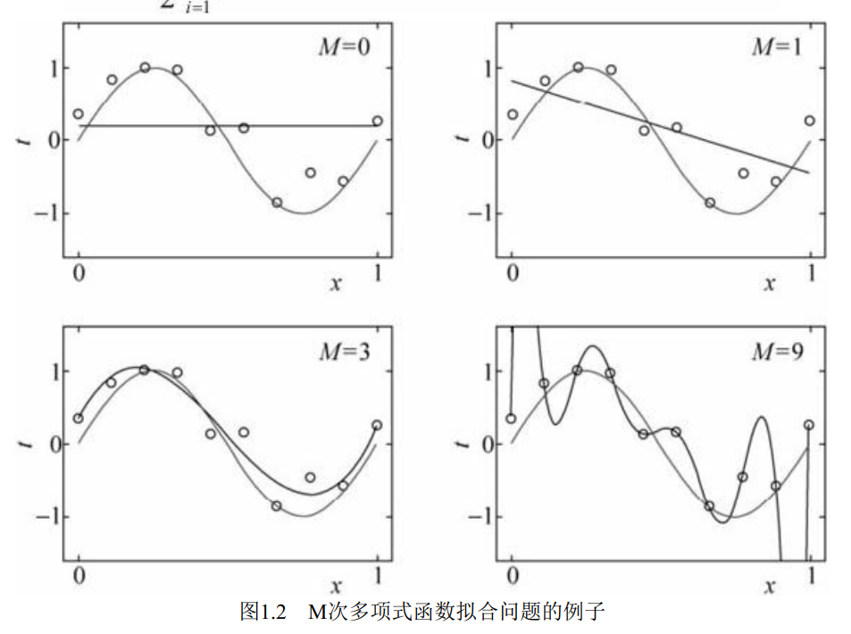
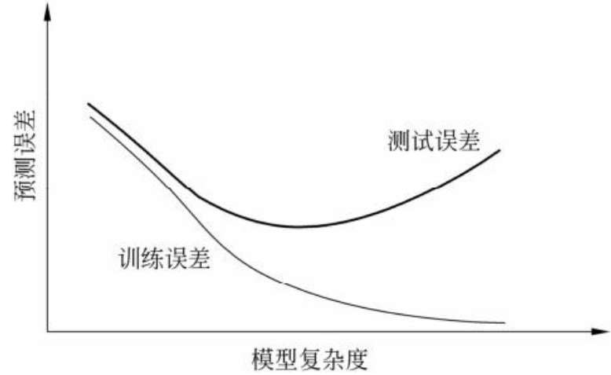

# Chapter1 统计学习方法概论
## 1.1 统计学习
* 统计学习(statistical learning)：是关于计算机基于数据结构构建概率统计模型并运用模型对数据进行预测与分析的一门学科。
* statistical learning 的学习对象是数据(data)。从数据出发，提取数据的特征，抽象出数据的模型，然后回到对数据的分析与预测。
* statistical learning由以下几个构成：
  * supervised learning 监督学习
  * unsupervised learning 非监督学习
  * semisupervised learning 半监督学习
  * reinforcement learning  强化学习
* supervised learning : 从 training data 集合出发，假设数据是独立同分布产生的；并且要学习的模型是某个函数的集合，称为假设空间(hypothesis space);应用某个评价准则(evaluation criterion),从假设空间选取一个最优的模型，应用于test data.

## 1.2 Supervised Learning
1. 输入空间、特征空间与输出空间
在监督学习中，将输入与输出所有可能的取值的集合分别称为 input space 和 output space。
每个具体的输入是一个 实例(instance)，通常由 特征向量(feature vector),所有的 feature vecture 存在的空间称为 feature space . 特征空间的每一维对应于一个特征。输入实例x的特征向量记作：
$$ x = (x^{(1)},x^{(2)},...,x^{(i)},...,x^{(n)})^T $$
训练集：
$$ T = \{(x_1,y_1),(x_2,y_2),...,(x_N,y_N)\} $$

2. 联合概率分布
    监督学习假设输入与输出的随机变量 X 和 Y 遵循联合概率分布 $P(X,Y)$。$P(X,Y)$表示分布函数，或分布密度函数。

3. 假设空间
   监督学习的目的在于学习一个由输入到输出的映射，这个映射的集合就是假设空间(hypothesis space).
   监督学习的模型可以是概率模型或非概率模型，由条件概率分布$P(X,Y)$或决策函数(decision function) $Y=f(x)$表示。

## 1.3 统计学习三要素
统计学习方法都是由模型、策略和算法构成。
方法 = 模型 + 策略 + 算法

### 1.3.1模型
在 supervised learning 中，模型就是所要学习的条件概率分布或决策函数。模型的hypothesis space包含所有可能的条件概率分布或决策函数。

### 1.3.2 策略
1. 损失函数和风险函数
 supervised learning的问题是在hypothesis space中选取模型f作为决策函数，对于给定的输入X,由$f(x)$给出相应的输出Y,这个输出的预测值f(x)和真实值Y可能不一致，用一个损失函数(loss function)或代价函数(cost function)来度量预测错误的程度。损失函数是f(x)和Y的非负实值函数，记住L(Y,f(x))
 常用损失函数：
(1) 0-1 loss function
$$ L(Y,f(X)) = \begin{cases}
    1 & Y\neq f(X) \\
    0 & Y=f(X)
\end{cases} $$
(2) quadratic loss function
$$ L(Y,f(X))=(Y-f(X))^2 $$
(3) absolute loss function
$$ L(Y,f(X))=|Y - f(X) |$$
(4)loglikelihood loss function 对数似然损失函数
$$ L(Y,P(Y|X)) = -logP(Y|X) $$
损失函数值越小，模型就越好，由于模型的输入、输出(X,Y)是随机变量，遵循联合分布P(X,Y),所以损失函数的期望是：
(期望比如：抛硬币正反为0，1，则 $P\{X=x_k\}=p_k,k=1,2. 期望E(X)= \sum_{k=1}^\infty x_kp_k=0.5$)

$$ R_{exp}(f)=E_P[L(Y,f(x))]=\int_{x*y} L(y,f(x))P(x,y)dxdy$$
这个是理论上模型f(x)关于联合分布P(X,Y)的平均意义下的损失，称为风险函数(risk function)
学习的目标就是选择期望风险最小的模型.由于联合分布P(X,Y)是未知的，$R_{exp}(f)$不能直接计算，实际上，如果知道联合分布 $P（X，Y）$就可以求出 $P（Y|X）$，不需要学习。正因为不知道联合概率分布，所以才需要学习。这样一来，一方面根据期望风险最小学习模型要用到联合分布，另外一方面联合分布位置，所以监督学习是一个 病态问题（ill-formed problem)
模型 $f(x)$ 关于训练数据集的平均损失为 经验风险（empirical risk) 或 经验损失 （empirical loss），记作 $R_{emp}$:
$$ R_{emp}(f)=1/N\sum_{i=1}^NL(y_i,f(x_i)) $$

期望风险 $R_{exp}(f)$ 是模型关于联合分布的期望损失，经验风险 $R_{emp}(f)$ 是模型关于训练样本集的平均损失， 根据 **大数定律** ，当样本容量N趋于无穷时，经验风险 $R_{emp}(f)$ （实际抛硬币的结果）趋于期望风险 $R_{exp}(f)$ （概率算出的）。所以用经验风险估计期望风险，但是样本有限，需要对经验风险进行一定的校正。这就关系到监督学习的两个基本策略：**经验风险最小化** 和 **结构风险最小化**。

2. **经验风险最小化** 和 **结构风险最小化**
在假设空间、 损失函数以及训练数据集确定的情况下， 经验风险函数式就可以确定。 经验风险最小化（ empirical risk minimization， ERM） 的策略认为， 经验风险最小的模型是最优的模型。根据这一策略， 按照 **经验风险最小化** 求最优模型就是求解最优化问题：
$$ min 1/N\sum_{i=1}^NL(y_i,f(x_i))$$
当样本容量足够大时，**经验风险最小化** 能保证有很好的学习效果，在现实中被广泛采用。当样本容量很小时，经验风险最小化学习的效果就未必很好，会产生后面将要叙述的“过拟合(over-fitting)”现象（过拟合会产生很多高阶项）.
**结构风险最小化**（ structural risk minimization， SRM）是为了防止过拟合而提出来的策略。结构风险最小化等价于正则化（regularization).结构风险是在经验风险上加上表示模型复杂度的正则化（regularier) 或 罚项。**结构风险最小化**：
$$ R_{srm}(f)=1/N\sum_{i=1}^NL(y_i,f(x_i))+\lambda J(f) $$
其中 J(f)为模型复杂度，$\lambda$是系数，用来权衡经验风险和模型复杂度。结构风险小需要经验风险与模型复杂度同时小。结构风险小的模型往往对训练数据以及未知的测试数据都有较好的预测。

### 1.3.3 算法
算法是指学习模型的具体计算方法，统计学习基于训练数据集，根据学习策略，从假设空间中选择最优模型，最后考虑用什么样的计算方法求解最优模型。
这时， 统计学习问题归结为最优化问题， 统计学习的算法成为求解最优化问题的算法。

## 1.4 模型评估与模型选择
### 1.4.1 训练误差与测试误差
统计学习的目的是使学到的模型不仅对 **已知数据** 而且对 **未知数据** 都能有很好的预测能力。不同的学习方法会给出不同的模型，当损失函数给定时，基于 **损失函数** 的模型的 **训练误差**（tranning error)  和模型的 **测试误差**(test error) 成为学习方法评估的标准。
假设学习到的模型是 $Y=\widehat{f}(X)$, **训练误差** 是模型 $Y=\widehat{f}(X)$ 关于训练数据集的 **平均误差**：
$$ R_{emp}(\widehat{f})=1/N\sum_{i=1}^NL(y_i,\widehat{f}(x_i)) $$
其中N是样本容量。
**测试误差** 是模型 $Y=\widehat{f}(X)$ 关于 **测试数据集**的平均误差：
$$ e_test = 1/N'\sum_{i=1}^NL(y_i,\widehat{f}(x_i))  $$
其中N'是测试样本容量。
训练误差的大小，对判断给定的问题是不是一个容易学习的问题是有意义的，但本质上不重要。测试误差反映了学习方法对未知的测试数据集的预测能力，是学习中的重要概念。显然，给定两种学习方法， 测试误差小的方法具有更好的预测能力，是更有效的方法。 通常将学习方法对未知数据的预测能力称为泛化能力（generalization ability）。

### 1.4.2 过拟合与模型选择
过拟合是指学习时选择的模型所包含的参数过多，以致于出现这一模型对已知数据预测得很好，但对未知数据预测得很差的现象。
例子：假设给一个训练数据集：
$$ T=\{(x_1,y_1),(x_2,y_2)...\} $$
假定给了10个数据点，用0~9次多项式函数对数据进行拟合，设M次多项式为：
$$ f_M(x,w)=\sum_{j=0}^Mw_jx^j $$

在多项式函数拟合中，随着多项式次数(模型复杂度)的增加，会过拟合。


### 1.5 正则化与交叉验证
### 1.5.1 正则化
模型选择的典型方法是正则化(regularization)，正则化是 **结构风险最小化** 策略的实现，是在 **经验风险** 上加上 一个 正则化项 或 罚项。正则化一般是模型复杂度的单调递增函数，模型越复杂，正则化值就越大，可以是模型参数向量的范数。
正则化形式：
$$ R_{srm}(f)=1/N\sum_{i=1}^NL(y_i,f(x_i))+\lambda J(f) $$
正则化项可以是 $L_2$范数：
$$ J(f)= \lambda/2 \parallel w \parallel^2 $$
$\parallel w \parallel^2$表示$L_2$ 范数，$\parallel w \parallel_1$表示$L_1$范数。
从贝叶斯估计的角度来看，正则化项对应于模型的 **先验概率**。
PS1: **范数**
L0范数：度量向量中非零元素的个数
L1范数：$|w_j|$
L2范数：$\sqrt{\sum_{j=0}^{N}w_j^2}$

PS2: 
**先验概率** 是指根据以往经验和分析得到的概率,如全概率公式,它往往作为"由因求果"问题中的"因"出现.

**后验概率** 是指依据得到"结果"信息所计算出的最有可能是那种事件发生,如贝叶斯公式中的,是"执果寻因"问题中的"因".

考虑一个问题：P(A|B)是在B发生的情况下A发生的可能性。
* 首先，事件B发生之前，我们对事件A的发生有一个基本的概率判断，称为A的 **先验概率**，用P(A)表示；
* 其次，事件B发生之后，我们对事件A的发生概率重新评估，称为A的 **后验概率**，用P(A|B)表示；
贝叶斯定理：
$$ P(B|A) = \frac{P(AB)}{P(A)} =  \frac{P(A|B)P(B)}{P(A)} $$
例子：已知某种疾病的发病率是0.001，即1000人中会有1个人得病。现有一种试剂可以检验患者是否得病，它的准确率是0.99，即在患者确实得病的情况下，它有99%的可能呈现阳性。它的误报率是5%，即在患者没有得病的情况下，它有5%的可能呈现阳性。现有一个病人的检验结果为阳性，请问他确实得病的可能性有多大？
假定A事件表示得病，那么P(A)为0.001。这就是"先验概率"，即没有做试验之前，我们预计的发病率。再假定B事件表示阳性，那么要计算的就是P(A|B)。这就是"后验概率"，即做了试验以后，对发病率的估计。
$$ P(A|B)= \frac{P(B|A)P(A)}{P(B)} = P(A)\frac{P(B|A)}{P(B|A)P(A)+P(B|\overline{A})P(\overline{A})}$$

### 1.5.2 交叉验证
如果给定的样本数据充足，进行模型选择的一种简单方法是随机地将数据集切分成三部分，分别为训练集（training set）、验证集（validation set）和测试集（test set）。 训练集用来训练模型，验证集用于模型的选择，而测试集用于最终对学习方法的评估。 

## 1.6 泛化能力
### 1.6.1 泛化误差
学习方法的泛化能力(generalization ability)是指由该方法学习到的模型对未知数据的预测能力，因为测试数据集是有限的，可能评价结果不可靠。
泛化误差的定义：学习到的模型是 $\widehat{f}$, 那么用这个模型对未知数据预测的误差即为 泛化误差(generalization error)

## 1.7 生成模型与判别模型
监督学习的任务就是学习一个模型，监督学习的方法可以分为 **生成方法**(generative approach) 和 **判别方法**(generative model)和判别模型(discriminnative model)。
生成方法：朴素贝叶斯法和隐马尔可夫模型
判别方法:k近邻法、 感知机、 决策树、 逻辑斯谛回归模型、 最大熵模型、 支持向量机、 提升方法和条件随机场

## 1.8 分类问题
在监督学习中，当输出变量Y取有限个离散值时，预测问题便成为分类问题，监督学习从数据中学习一个分类模型，称为分类器(classifier)，

## 作业解答
### 最小二乘法
在所有无偏的线性估计类中，最小二乘法时方差最小的。

### 使用最小二乘法拟合曲线
对于数据$(x_i,y_i)(i=1,2,3...m)$
拟合出函数h(x)，有误差，即残差：$r_i=h(x_i)-y_i$
此时$L_2$范数(残差平方和)最小时，拟合程度高。
设$H(x)$为：$H(x)=w_0+w_1x+w_2x^2+...w_nx^n$
$w(w_0,w_1,w_2...w_n)为参数$
最小二乘法就是找到一组w(w_0,w_1,w_2...w_n)使得$\sum_{i=1}^n(h(x_i-y_i)^2$最小。

比如用目标函数$y=sin2\pi x$,加上一个正态分布的噪音干扰，用多项式去拟合。
```python
import numpy as np 
import scipy as scipy
from scipy.optimize import leastsq
import matplotlib.pyplot as plt

#目标函数
def real_func(x):
    return np.sin(2*np.pi*x)

#多项式
def fit_func(p,x):
    f = np.poly1d(p) #np.poly1d([1,2,3])生成1x^2+2x+3
    return f(x) #f(x)是求x = num时的输出值

#残差
def residuals_func(p,x,y):
    ret = fit_func(p,x) - y
    return ret

#十个点
x = np.linspace(0,1,10) #linspace产生等差数列
x_points = np.linspace(0,1,100)
#加上正态分布噪音的目标函数的值
y_ = real_func(x)
y = [np.random.normal(0,0.1) + y1 for y1 in y_]
# normal正态分布

def fitting(M=0):
    # n为多项式的系数
    # 随机初始化多项式参数
    #返回一组服从“0~1”均匀分布的随机样本值，随机样本值取值范围
    #是[0,1),不包括1
    p_init = np.random.rand(M+1)
    #最小二乘法,第一个放入残差函数，第二个放入拟合方程的初始系数
    #将其余参数打包到args中
    p_lsq = leastsq(residuals_func,p_init,args=(x,y))
    print("Fitting Parameters", p_lsq[0])

    #可视化
    plt.plot(x_points, real_func(x_points), label="real")
    plt.plot(x_points, fit_func(p_lsq[0], x_points), label='fitted curve')
    plt.plot(x,y,'bo',label = 'noise')
    #显示图例，显示标签的摆放位置
    plt.legend()
    plt.show()
    return p_lsq
#M=0
p_lsq_0 = fitting(M=0)

#M=1
p_lsq_1 = fitting(M=1)

#M=3
p_lsq_3 = fitting(M=3)

#M=9
p_lsq_9 = fitting(M=9)
##############################################################
#正则化
#结果显示过拟合，引入正则项，降低过拟合，回归问题中，正则化可以是：
#L1：regularization *abs(p)
#L2: 0.5 * regularization * np.square(p)

regularization = 0.0001

def residuals_func_regularization(p,x,y):
    ret = fit_func(p,x) - y
    ret = np.append(ret, np.sqrt(0.5 * regularization* np.square(p)))
    return ret 
#最小二乘法，加正则项
p_init = np.random.rand(9+1)
p_lsq_regularization = leastsq(
    residuals_func_regularization,p_init,args=(x,y))

plt.plot(x_points, real_func(x_points), label='real')
plt.plot(x_points, fit_func(p_lsq_9[0], x_points), label='fitted curve')
plt.plot(x_points, fit_func(p_lsq_regularization[0], x_points), label='regularization')
plt.plot(x, y, 'bo', label='noise')
plt.legend()
plt.show()

```

