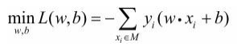
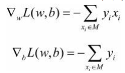

# Chapter2 感知机
感知机(perceptron) 是二类分类的线性分类模型，其输入为 **实例的特征向量**，输出为 **实例的类别**，取 +1 和 -1二值。感知机对应于输入空间（特征空间）中将实例划分为正负两类的分离超平面，属于 **判别模型**。感知机学习旨在求出将训练数据进行线性划分的 **分离超平面**，为此，导入基于误分类的损失函数，利用梯度下降法对损失函数进行极小化，求得感知机模型。感知机学习算法具有简单而易于实现的优点，分为原始形式和对偶形式。感知机预测是利用学习得到的感知机模型对新的输入实例进行分类。

## 感知机模型
* 感知机定义：假设输入空间是$x \subseteq R^n $,输出空间是 $y = \{+1.-1\}.$ 由输入空间到输出空间的函数：
$$ f(x) = sign(w*x+b) $$
称为感知机，其中，w和b为感知机模型参数，$w \in R^n$叫做权值(weight)或权值向量(weirht vector), $b \in R$叫做偏置，sign是符号函数.
感知机是一种线性分类模型，属于判别模型。

# 感知机算法
感知机学习算法是误分类驱动的，具体采用随机梯度下降法(stochastic gradient descent)。首先任意选取一个超平面 $w_0,b_0$,然后用随机梯度下降法不断极小化目标函数：

极小化过程中不是一次使M中所有误分类点的梯度下降，而是一次随机选取一个误分类点使梯度下降。
假设误分类点集合M是固定的，那么损失函数$L(w,b)$的梯度由：

